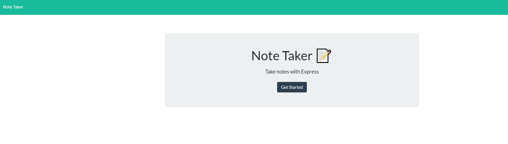

# **Note Taker**

* [Description](description)

* [Installation](installation)

* [Information](information)

## Description
An app that allows the user to take notes and save them. It is an easy app to use, The user Enters a title and the information that is needed then save. The information that is saved can be retrieved or deleted as needed.
## Installation
Download the program and in the terminal enter "node server" to open the port. then in the browser enter localhost:8080 to use the app. 
## Information
When the app is running in the browser, enter titles and text to save, delete if not needed.
